<p align="center">
  
</p>

<h1 align="center">Dayan Cabrera</h1>

<!-- STATUS:START -->
<p align="center"><sub>Around · last push 25h ago</sub></p>
<!-- STATUS:END -->

<p align="center">
  
</p>

<p align="center">
  Backend &amp; AI engineer. I build compilers, NLP pipelines and network protocols — mostly in Python and Rust, always on Linux.
</p>

<p align="center">
  <a href="#hulk-playground">Run code on my compiler</a> ·
  <a href="#tetris">Watch Tetris</a> ·
  <a href="#lately">Lately</a> ·
  <a href="#projects">Projects</a> ·
  <a href="#what-i-work-with">Stack</a>
</p>

## HULK playground

I wrote a [compiler](https://github.com/DayanCabrera2003/hulk_compiler) in Rust for HULK, an object-oriented language: lexer to LLVM, native executables. You can run it from here without knowing the language. Pick an example, press **Create**, and the compiler answers in the issue.

[▶ Hello World](https://github.com/DayanCabrera2003/DayanCabrera2003/issues/new?title=hulk%3A%20hello&body=Press%20%2A%2ACreate%2A%2A%20to%20run%20this%20on%20my%20compiler%20%E2%80%94%20or%20edit%20the%20code%20first.%20The%20answer%20arrives%20here%20in%20about%20a%20minute.%0A%0A%60%60%60hulk%0Aprint%28%22Hello%20World%22%29%3B%0A%60%60%60%0A) &nbsp;·&nbsp; [▶ Fibonacci](https://github.com/DayanCabrera2003/DayanCabrera2003/issues/new?title=hulk%3A%20fibonacci&body=Press%20%2A%2ACreate%2A%2A%20to%20run%20this%20on%20my%20compiler%20%E2%80%94%20or%20edit%20the%20code%20first.%20The%20answer%20arrives%20here%20in%20about%20a%20minute.%0A%0A%60%60%60hulk%0Afunction%20fib%28n%3A%20Number%29%3A%20Number%20%3D%3E%0A%20%20%20%20if%20%28n%20%3C%3D%201%29%20n%20else%20fib%28n%20-%201%29%20%2B%20fib%28n%20-%202%29%3B%0A%0Afor%20%28i%20in%20range%280%2C%2012%29%29%20print%28fib%28i%29%29%3B%0A%60%60%60%0A) &nbsp;·&nbsp; [▶ Classes & inheritance](https://github.com/DayanCabrera2003/DayanCabrera2003/issues/new?title=hulk%3A%20classes&body=Press%20%2A%2ACreate%2A%2A%20to%20run%20this%20on%20my%20compiler%20%E2%80%94%20or%20edit%20the%20code%20first.%20The%20answer%20arrives%20here%20in%20about%20a%20minute.%0A%0A%60%60%60hulk%0Atype%20Animal%28name%3A%20String%29%20%7B%0A%20%20%20%20name%3A%20String%20%3D%20name%3B%0A%20%20%20%20speak%28%29%3A%20String%20%3D%3E%20%22...%22%3B%0A%20%20%20%20intro%28%29%3A%20String%20%3D%3E%20self.name%20%40%40%20%22says%22%20%40%40%20self.speak%28%29%3B%0A%7D%0A%0Atype%20Dog%28name%3A%20String%29%20inherits%20Animal%28name%29%20%7B%0A%20%20%20%20speak%28%29%3A%20String%20%3D%3E%20%22Woof%21%22%3B%0A%7D%0A%0Atype%20Cat%28name%3A%20String%29%20inherits%20Animal%28name%29%20%7B%0A%20%20%20%20speak%28%29%3A%20String%20%3D%3E%20%22Meow.%22%3B%0A%7D%0A%0A%7B%0A%20%20%20%20print%28new%20Dog%28%22Rex%22%29.intro%28%29%29%3B%0A%20%20%20%20print%28new%20Cat%28%22Misu%22%29.intro%28%29%29%3B%0A%7D%0A%60%60%60%0A) &nbsp;·&nbsp; [▶ Break it](https://github.com/DayanCabrera2003/DayanCabrera2003/issues/new?title=hulk%3A%20break%20it&body=Press%20%2A%2ACreate%2A%2A%20to%20run%20this%20on%20my%20compiler%20%E2%80%94%20or%20edit%20the%20code%20first.%20The%20answer%20arrives%20here%20in%20about%20a%20minute.%0A%0A%60%60%60hulk%0A//%20The%20type%20checker%20should%20catch%20this%20before%20anything%20runs.%0Alet%20total%3A%20Number%20%3D%20%22forty-two%22%20in%20print%28total%20%2B%201%29%3B%0A%60%60%60%0A)

<details>
<summary>HULK in 30 seconds</summary>

```js
print("text" @ " joined" @@ "with a space");      // strings
let x = 5, y = x * 2 in print(x + y);             // variables
function square(n: Number): Number => n ^ 2;      // functions
if (x > 3) print("big") else print("small");      // conditionals
for (i in range(0, 5)) print(i);                  // loops
let v = [n ^ 2 | n in range(1, 6)] in print(v[2]); // vectors

type Point(x: Number, y: Number) {                // classes
    x: Number = x;
    y: Number = y;
    norm(): Number => sqrt(self.x ^ 2 + self.y ^ 2);
}
print(new Point(3, 4).norm());
```

Built-ins: `print`, `range`, `sqrt`, `sin`, `cos`, `exp`, `log`, `rand`, `PI`, `E`. Programs get 3 seconds and 40 lines of output.

</details>

<!-- HULK:START -->
Last run: [#10](https://github.com/DayanCabrera2003/DayanCabrera2003/issues/10) by [@DayanCabrera2003](https://github.com/DayanCabrera2003)

```js
print("Hello World");
```

**✅ Compiled and ran**

Output:

```text
Hello World
```
<!-- HULK:END -->

## Tetris

A bot is playing one game of Tetris here and it never loses. It looks a piece ahead, keeps the stack low and clears lines forever. What you see is the latest stretch of the game on a loop; every few hours it picks up where it left off and plays the next one.

<p align="center">
  
</p>

<!-- TETRIS:START -->
One endless game · **630** pieces placed · **251** lines cleared so far
<!-- TETRIS:END -->

## Lately

What I have been pushing to, straight from my public activity.

<!-- LATELY:START -->
- [`daa-blossom-game`](https://github.com/DayanCabrera2003/daa-blossom-game) · pushed Oct 6
- [`hulk_compiler`](https://github.com/DayanCabrera2003/hulk_compiler) · pushed Oct 5
- [`Almacen-Distribuido`](https://github.com/DayanCabrera2003/Almacen-Distribuido) · pushed Sep 29
- [`Horario`](https://github.com/DayanCabrera2003/Horario) · pushed Sep 28
<!-- LATELY:END -->

## Projects

<details open>
<summary>📰 <b>PerspectiVa</b> — how different outlets cover the same story</summary>

Spanish news comparison platform. Ingests 10K+ articles a day from 8 sources via RSS and scraping, groups them by story with DBSCAN over sentence embeddings, and uses GPT to point out what each outlet leaves out. Redis cache, full Docker stack.

`FastAPI` `spaCy` `DBSCAN` `PostgreSQL` `Redis` `Angular` · [Repository](https://github.com/DayanCabrera2003/PerspectiVa)

</details>

<details>
<summary>⚙️ <b>HULK Compiler</b> — an object-oriented language, from source to native code</summary>

Nine-stage pipeline in Rust: lexer, parser with error recovery, name resolution, type inference, typed IR, macros, desugaring, three-address IR and LLVM code generation. Classes, inheritance, polymorphism, protocols, vectors and macros, with a C runtime. It is the compiler behind the playground above.

`Rust` `LLVM` `C` · [Repository](https://github.com/DayanCabrera2003/hulk_compiler)

</details>

<details>
<summary>🧭 <b>TuristIA</b> — multi-agent itinerary planner for Cuba</summary>

RAG system that builds tourism itineraries from natural-language requests. FAISS semantic search feeds three metaheuristic optimizers (genetic algorithm, particle swarm, ant colony), with Gemini as the language interface.

`Python` `FAISS` `RAG` `Gemini API` `Streamlit` · [Repository](https://github.com/DayanCabrera2003/TuristAI)

</details>

<details>
<summary>🔌 <b>Link-Chat</b> — messaging over raw Ethernet frames</summary>

A layer 2 protocol that skips TCP/IP entirely. Broadcast and unicast messages, file transfer with fragmentation, and automatic device discovery with timeout handling.

`Python` `Raw sockets` `Ethernet` · [Repository](https://github.com/DayanCabrera2003/Link-Chat)

</details>

## What I work with

**Languages**

<p>
  
  
  
  
  
</p>

**Backend**

<p>
  
  
  
  
  
  
</p>

**AI / NLP**

<p>
  
  
  
  
  
  
</p>

**Systems**

<p>
  
  
  
  
</p>

**Frontend**

<p>
  
  
  
</p>

<p align="center">
  <a href="https://github.com/DayanCabrera2003?tab=repositories">More repositories</a>
</p>
